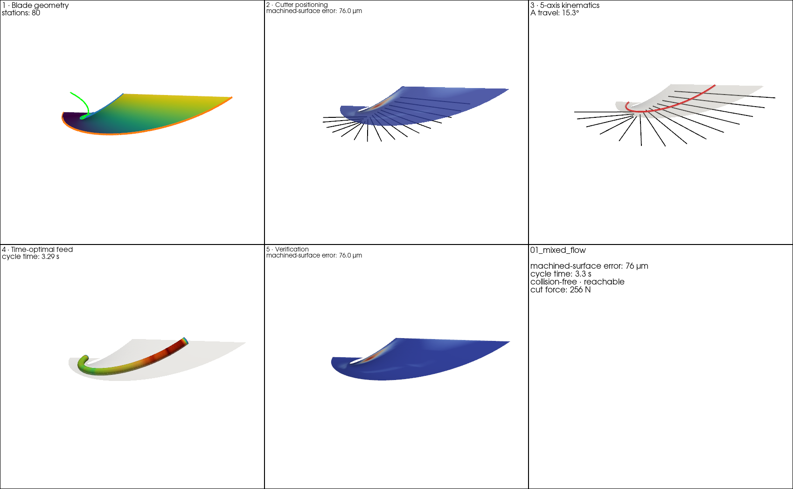
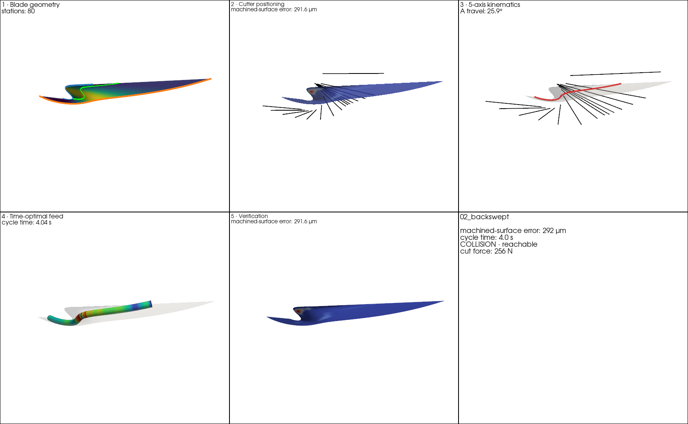
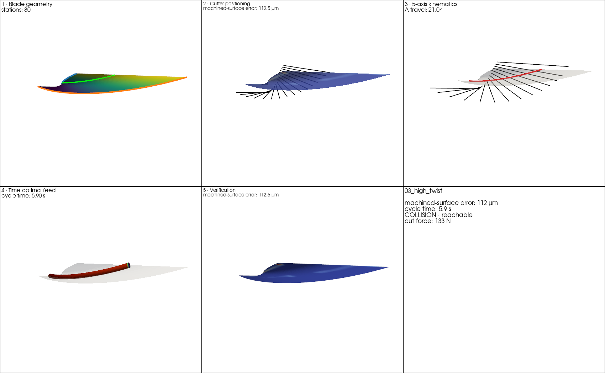
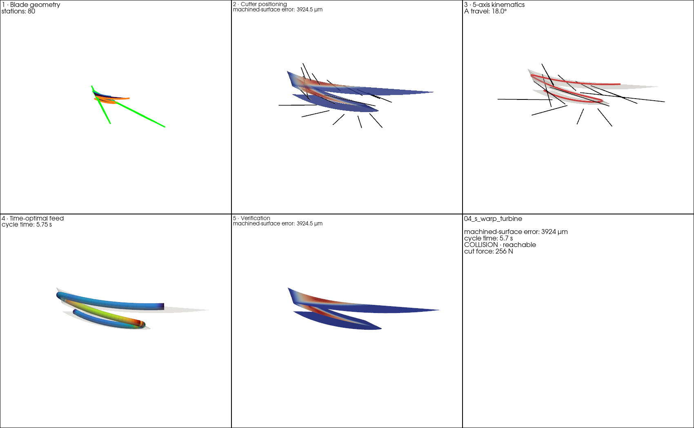
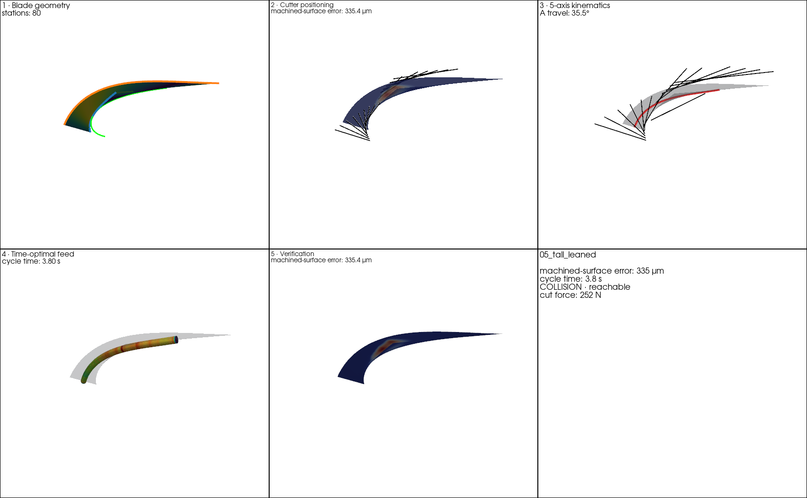
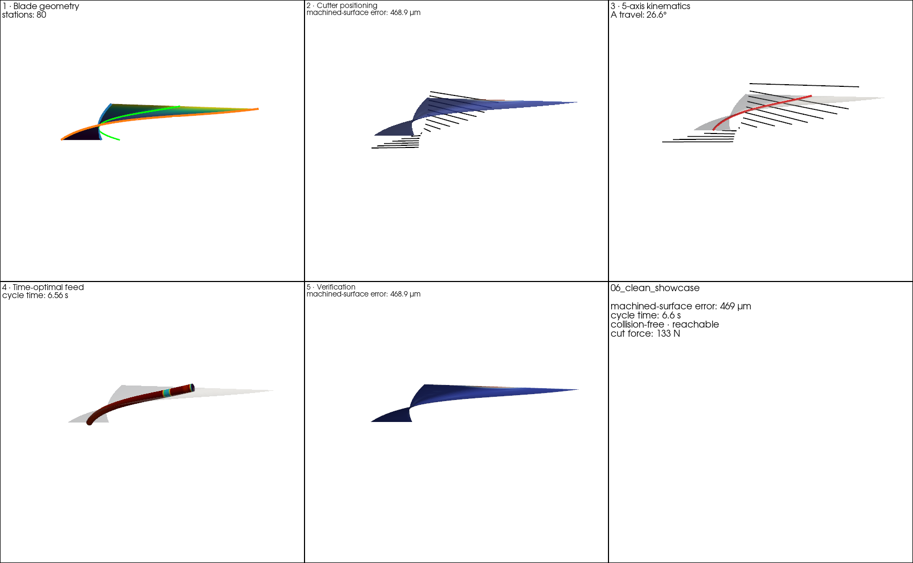

# BladeCAM super-complex demo gallery

Realistic centrifugal / mixed-flow / blisk blades, each shown as a 5-stage **workflow montage** (geometry → positioning → kinematics → feed → verification).

## 01_mixed_flow

Mixed-flow impeller: the flank sweeps from axial to radial (the radius bulges mid-span) with real twist — and a cylinder still machines it well.

- machined-surface error **76 µm** · cycle 3.3 s · ✅ · reachable · finite=True
- operations: {'rough_len_mm': 5592.539658222864, 'fillet_gouge_free': True, 'rest_fraction': 0.40994572623163145, 'n_stacked': 1}

## 02_backswept

Backswept centrifugal blade: the trailing edge leans back (advance ∝ u²) with an S-warp — a strongly 3-D flank.

- machined-surface error **292 µm** · cycle 4.0 s · ⚠️ collision · reachable · finite=True
- operations: {'rough_len_mm': 4880.480865765845, 'fillet_gouge_free': True, 'rest_fraction': 0.29896998434931193, 'n_stacked': 1}

## 03_high_twist

A strongly twisted blisk blade — high non-developability; the swept penalty tilts the axes to keep the envelope error in check.

- machined-surface error **112 µm** · cycle 5.9 s · ⚠️ collision · reachable · finite=True
- operations: {'rough_len_mm': 4884.1052979657, 'fillet_gouge_free': True, 'rest_fraction': 0.24631564843688558, 'n_stacked': 1}

## 04_s_warp_turbine

An S-warped turbine flank (inflected camber): a cylinder fundamentally cannot fit it — the render shows WHERE the envelope overcuts (the honest flank-milling limit; use a barrel/point-mill here).

- machined-surface error **3924 µm** · cycle 5.7 s · ⚠️ collision · reachable · finite=True
- operations: {'rough_len_mm': 7962.402781946339, 'fillet_gouge_free': True, 'rest_fraction': 0.34192939390959887, 'n_stacked': 1}

## 05_tall_leaned

A tall, leaned blade (z-bowed shroud) — machined as stacked flank passes (each pass a thinner sub-band of the ruling).

- machined-surface error **335 µm** · cycle 3.8 s · ⚠️ collision · reachable · finite=True
- operations: {'rough_len_mm': 5976.25933386986, 'fillet_gouge_free': True, 'rest_fraction': 0.2983561882167433, 'n_stacked': 1}

## 06_clean_showcase

A complex centrifugal blisk blade — strongly twisted, tall, and leaned — tuned with a right-sized tool and channel so the whole job processes COLLISION-FREE out of the box (swept-optimal axes already clear, no avoidance needed), feed-feasible, and the post certifies. The end-to-end 'it just works' exemplar (swept ~120 um). Turn ON 'Avoid collisions' to tighten the one closest ruling further.

- machined-surface error **469 µm** · cycle 6.6 s · ✅ · reachable · finite=True
- operations: {'rough_len_mm': 5770.0347649958485, 'fillet_gouge_free': True, 'rest_fraction': 0.27700045204334683, 'n_stacked': 1}

