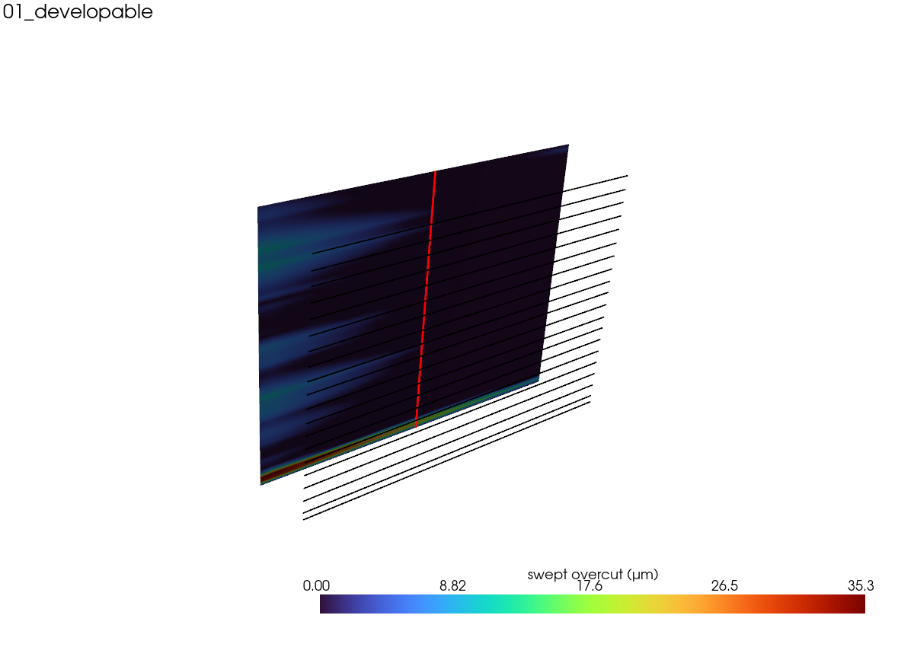
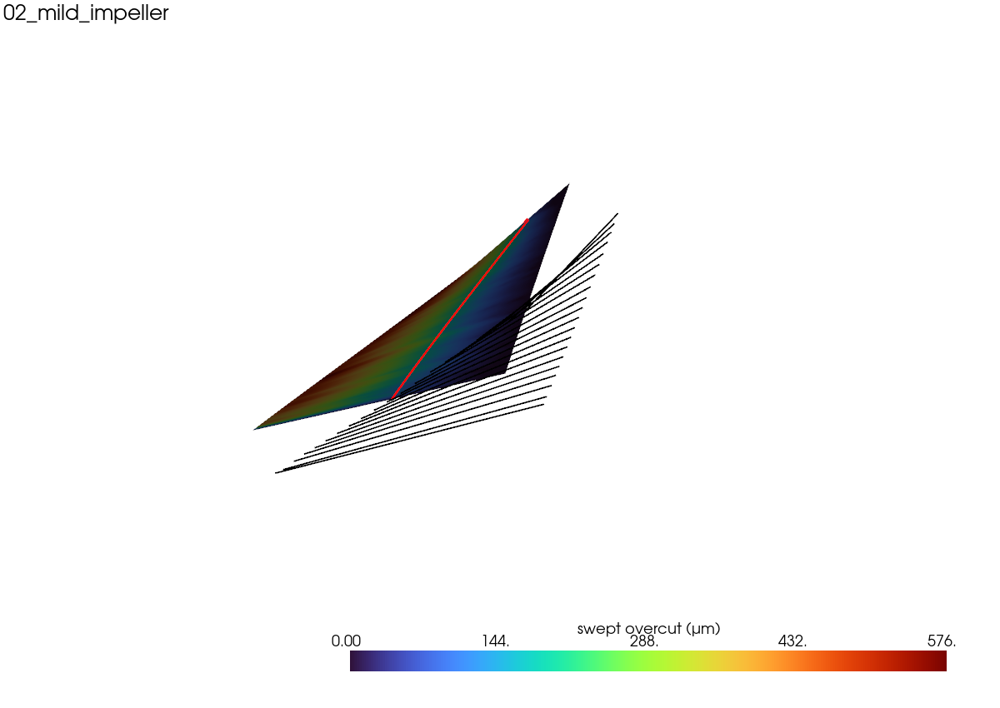
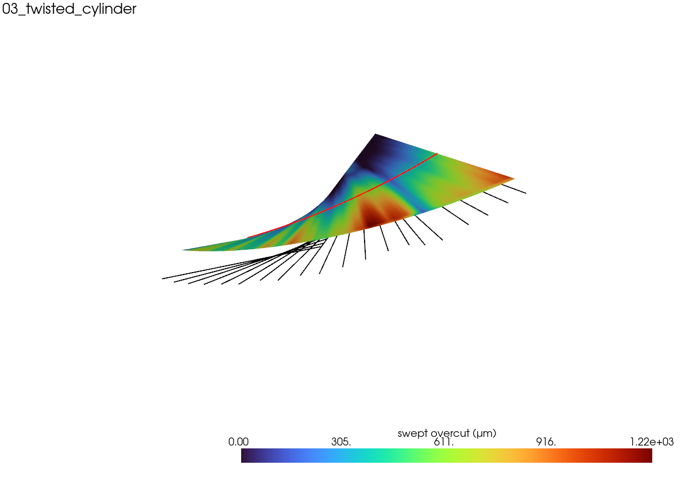
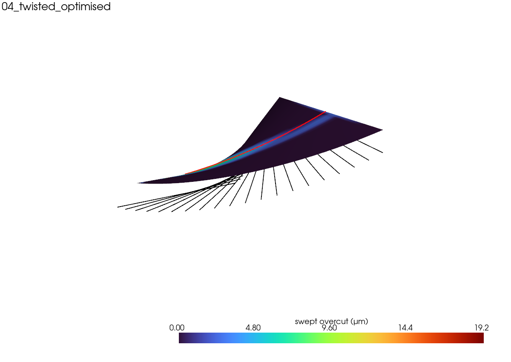
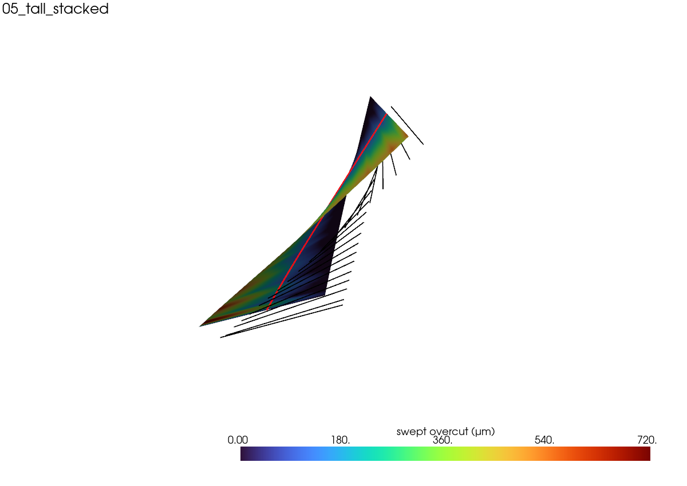
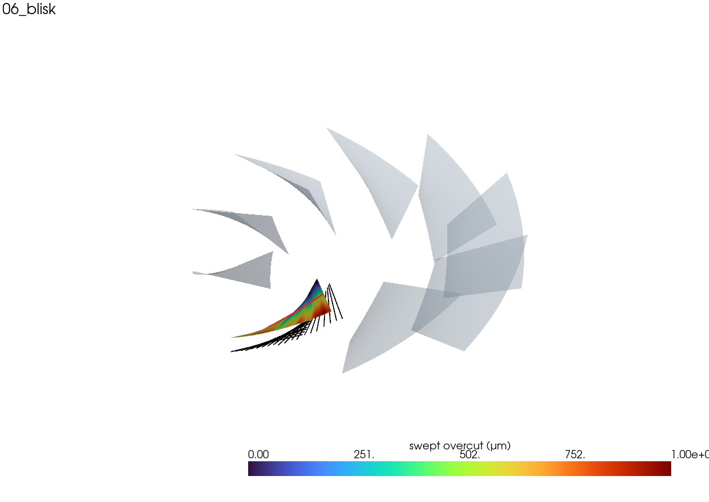

# BladeCAM demo gallery

Generated by `demos/make_demos.py`. Each `*_rails.csv` / `*.step` loads straight into the GUI.

| part | swept err (µm) | per-ruling dev (µm) | cycle (s) | collision-free | reachable | render |
|---|--:|--:|--:|:--:|:--:|---|
| **01_developable** | 35.3 | 0.0 | 0.55 | ✅ | ✅ |  |
| **02_mild_impeller** | 575.7 | 0.0 | 0.98 | ✅ | ✅ |  |
| **03_twisted_cylinder** | 1221.8 | 0.1 | 2.33 | ✅ | ✅ |  |
| **04_twisted_optimised** | 19.2 | 101.6 | 2.41 | ✅ | ✅ |  |
| **05_tall_stacked** · 2 stacked passes | 720.0 | 0.1 | 1.62 | ❌ | ✅ |  |
| **06_blisk** | 1003.2 | 0.1 | 1.72 | ✅ | ✅ |  |

- **01_developable** — DEVELOPABLE flank (zero twist): a cylinder machines it essentially exactly — the ideal reference case (~10 µm).
- **02_mild_impeller** — A gently twisted, realistic impeller blade — modest envelope error.
- **03_twisted_cylinder** — A properly TWISTED blade with a plain cylinder: the swept-envelope error grows (≈ R·ℓ²/δ²) — the real flank-milling limit. (Before.)
- **04_twisted_optimised** — The SAME twisted blade, with the swept-overcut penalty on: the optimiser tilts the axes to minimise the real envelope error (≈20× lower). (After.)
- **05_tall_stacked** — A tall blade — taller than the usable flute, so it is split into stacked flank passes (each a thinner sub-band).
- **06_blisk** — A full blisk: several blades around the hub (load any one rail set, or the compound STEP, into the GUI).
